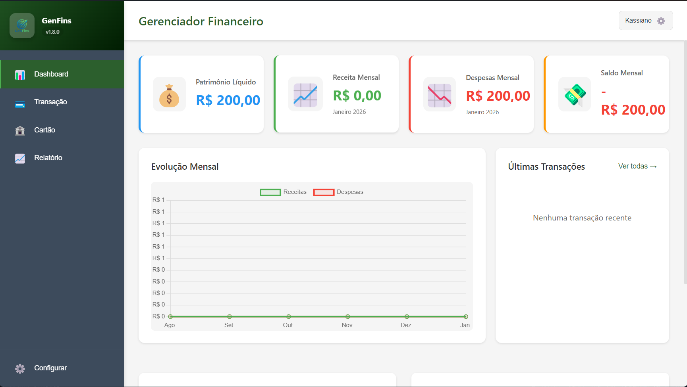
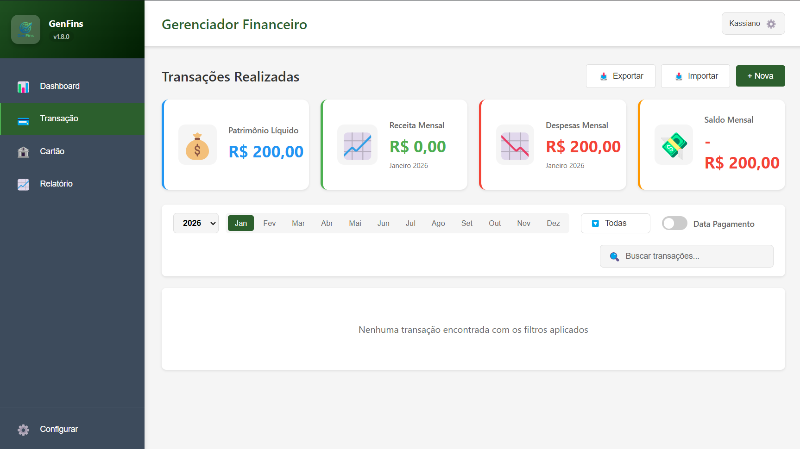
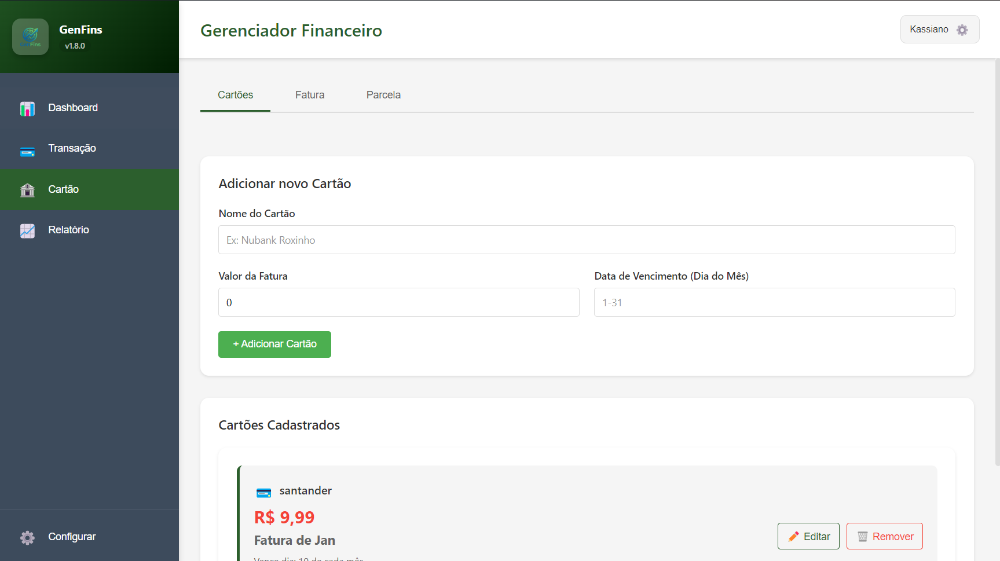
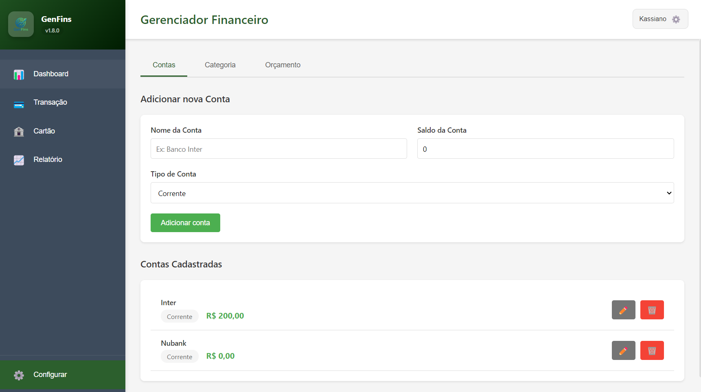

# 💰 GenFins - Gerenciador Financeiro Pessoal

<div align="center">
  
  
  <p><strong>Sistema completo de gestão financeira pessoal desenvolvido com Electron</strong></p>
  
  [](CHANGELOG.md)
  [](LICENSE.txt)
  [](https://www.electronjs.org/)
  [](https://www.typescriptlang.org/)
  [](package.json)
  [](eslint.config.mjs)


---

## 📑 Índice

- [Destaques da Versão](#-destaques-da-versão-180)
- [Funcionalidades](#-funcionalidades)
- [Início Rápido](#-início-rápido)
- [Build e Distribuição](#-build-e-distribuição)
- [Arquitetura](#️-arquitetura)
- [Qualidade de Código](#-qualidade-de-código)
- [Tecnologias](#️-tecnologias)
- [Importação de Extratos](#-importação-de-extratos-bancários)
- [Gestão de Cartões](#-gestão-de-cartões-de-crédito)
- [Screenshots](#-screenshots)
- [Documentação](#-documentação)
- [Contribuindo](#-contribuindo)
- [Roadmap](#-roadmap)
- [Status do Projeto](#-status-do-projeto)
- [FAQ](#-faq-perguntas-frequentes)
- [Troubleshooting](#-troubleshooting)
- [Licença](#-licença)
- [Autor](#-autor)

---

## ✨ Destaques da Versão 1.8.0

- 👥 **Suporte Multi-Usuário Completo** - Isolamento total de dados por usuário
- 🔧 **Correção de Resumo Financeiro** - Valores agora somam corretamente no dashboard e relatórios
- 💳 **Exibição de Valor de Cartões** - Valor inicial + transações do mês exibidos corretamente
- 📋 **Categorias nos Dropdowns** - Categorias agora aparecem em todas as telas (transações, fatura, parcela)
- 🔄 **Atualização Automática de Cards** - Cards de resumo atualizam após criar/editar/excluir transações
- 📥 **Importação OFX** - Importe extratos bancários e faturas automaticamente
- 🤖 **Categorização Automática** - Transações categorizadas inteligentemente
- 🔒 **Segurança Reforçada** - CSP, validação de dados e proteção contra SQL Injection

---

## 🌟 Funcionalidades

### 💼 Gestão Financeira Completa

| Módulo | Recursos |
|--------|----------|
| **Dashboard** | Cards de resumo, gráfico de evolução mensal, orçamentos, últimas transações, gastos nos cartões |
| **Transações** | CRUD completo, filtros avançados, paginação, exportar/importar CSV e OFX |
| **Cartões de Crédito** | Gestão de cartões, faturas mensais, lançamento de compras, parcelamento, importação OFX |
| **Contas** | Múltiplas contas, tipos variados, edição com saldo automático |
| **Categorias** | Personalizáveis, cores, separação por tipo, categorização automática |
| **Orçamentos** | Planejamento mensal, acompanhamento visual, alertas |
| **Relatórios** | Gráficos de pizza, análise por período, informações de cartões |

### 📊 Visualizações

- 📈 Gráfico de evolução dos últimos 6 meses
- 🥧 Gráficos de pizza por categoria
- 📊 Barras de progresso de orçamentos
- 💳 Cards com indicadores visuais coloridos

### ⚡ Funcionalidades Avançadas

- ✅ Exportar transações para CSV
- ✅ Importar extrato bancário (OFX padrão)
- ✅ Importar fatura de cartão de crédito (OFX)
- ✅ Categorização automática de transações
- ✅ Paginação de transações (10, 20, 50, 100 itens)
- ✅ Gestão completa de cartões de crédito
- ✅ Lançamento de compras parceladas
- ✅ Filtros dinâmicos por ano (últimos 3 anos), mês, tipo e busca
- ✅ Debounce em campos de busca
- ✅ Edição completa de todas entidades
- ✅ Toast notifications para feedback
- ✅ Hot reload em desenvolvimento
- ✅ Interface responsiva
- ✅ Content Security Policy implementado
- ✅ Sistema de testes automatizados (92 testes)
- ✅ Lint e formatação de código (ESLint + Prettier)
- ✅ Sistema de changelog automatizado (Conventional Commits)

---

## 🚀 Início Rápido

### 📋 Pré-requisitos

**Para Desenvolvimento:**
- [Node.js](https://nodejs.org/) v18 ou superior
- npm v9 ou superior (incluído no Node.js)
- Git (para clonar o repositório)

**Para Uso (instalador):**
- Windows 10/11 (64-bit)
- Linux (Ubuntu 20.04+, Fedora, Debian)
- macOS 10.13+ (High Sierra ou superior)

**Requisitos de Sistema:**
- 200 MB de espaço em disco
- 4 GB de RAM (mínimo 2 GB)
- Resolução mínima: 1280x720

### 📥 Instalação
```bash
# Clone o repositório
git clone https://github.com/seu-usuario/genfins.git

# Entre no diretório
cd genfins

# Instale as dependências
npm install

# Execute em modo de desenvolvimento
npm run dev
```

---

## 📦 Build e Distribuição

### Desenvolvimento
```bash
# Modo desenvolvimento (hot reload)
npm run dev

# Compilar TypeScript
npm run build

# Limpar builds anteriores
npm run clean

# Executar testes
npm run test

# Testes com cobertura
npm run test:coverage

# Executar lint
npm run lint

# Formatar código
npm run format
```

### Produção
```bash
# Build completo com instalador
npm run build:prod

# Build sem instalador (para teste)
npm run build:dir

# Build para todas as plataformas
npm run build:all
```

**📁 Saída:** `release/GenFins-1.8.0-Setup.exe` (Windows)

### Versionamento
O projeto segue [Semantic Versioning](https://semver.org/lang/pt-BR/).
Todas as mudanças são documentadas manualmente no [CHANGELOG.md](CHANGELOG.md).

---

## 🏗️ Arquitetura
```
GenFins/
├── 📁 src/
│   ├── 📁 types/          # TypeScript interfaces
│   ├── 📁 database/       # SQLite manager (sql.js)
│   ├── 📁 main/           # Electron main process
│   ├── 📁 preload/        # Context bridge (IPC)
│   └── 📁 renderer/       # Frontend (HTML/CSS/JS)
│       ├── 📄 index.html
│       ├── 📁 styles/     # CSS modular
│       └── 📁 scripts/    # JavaScript modular
├── 📁 assets/             # Ícones e recursos
├── 📁 dist/               # Build TypeScript
└── 📁 release/            # Instaladores gerados
```

### 🔄 Fluxo de Dados
```
┌─────────────┐      IPC       ┌──────────────┐
│  Renderer   │ ◄────────────► │ Main Process │
│  (Frontend) │   Context      │  (Backend)   │
└─────────────┘    Bridge      └──────────────┘
                                       │
                                       ▼
                                 ┌──────────┐
                                 │  SQLite  │
                                 │ Database │
                                 └──────────┘
```

---

## 🧪 Qualidade de Código

### Testes
- **92 testes** automatizados com Jest
- Testes unitários e de integração
- Testes de segurança do banco de dados
- Testes de validação de dados
- Testes de performance
- Cobertura de código completa

### Linting e Formatação
- **ESLint v9** com flat config
- Integração com **Prettier** para formatação consistente
- 0 erros de lint em produção
- Scripts de correção automática: `npm run lint:fix`
- Verificação de formatação: `npm run format:check`

### Segurança
- Content Security Policy (CSP) implementado
- Validação de entrada de dados com Zod
- Proteção contra SQL Injection
- Foreign keys habilitadas no SQLite
- Sanitização de dados do usuário

### Performance
- Paginação no backend (database.ts:659-710)
- Debounce em campos de busca
- Queries otimizadas no banco de dados
- Lazy loading de componentes

---

## 🛠️ Tecnologias

| Tecnologia | Versão | Uso |
|------------|--------|-----|
| **Electron** | 28.1.0 | Framework desktop multiplataforma |
| **TypeScript** | 5.3.3 | Linguagem com tipagem estática |
| **SQLite** (sql.js) | 1.10.3 | Banco de dados local |
| **Chart.js** | 4.4.0 | Biblioteca de gráficos |
| **Electron Builder** | 24.9.1 | Build e distribuição |
| **Jest** | 29.7.0 | Framework de testes |
| **ESLint** | 9.39.2 | Linter de código |
| **Prettier** | 3.7.4 | Formatador de código |
| **Zod** | 3.22.4 | Validação de schemas |
| **Winston** | 3.19.0 | Sistema de logging |
| **Conventional Changelog** | 4.1.0 | Geração automática de changelog |

---

## 📥 Importação de Extratos Bancários

O GenFins suporta importação de extratos bancários no formato OFX (Open Financial Exchange), padrão aceito por todos os bancos.

### Como Importar

#### 1. Obter o Arquivo OFX
- Acesse o site ou app do seu banco
- Procure por "Extrato" ou "Exportar movimentações"
- Escolha o formato **OFX** (não CSV ou PDF)
- Baixe o arquivo

#### 2. Importar no GenFins
```
Transações → Importar
- Selecione a conta bancária de destino
- Escolha o arquivo OFX baixado
- Aguarde o processamento
- Revise as transações no preview
- Confirme a importação
```

### Categorização Automática
O sistema categoriza automaticamente as transações com base em palavras-chave na descrição:
- **Alimentação**: supermercado, padaria, restaurante, mercado
- **Transporte**: uber, 99, combustível, posto
- **Saúde**: farmácia, drogaria, hospital, médico
- E muitas outras...

### Recursos da Importação
- ✅ Detecção automática de duplicatas
- ✅ Categorização inteligente
- ✅ Preview antes de importar
- ✅ Estatísticas da importação
- ✅ Validação de dados
- ✅ Tratamento de erros

---

## 💳 Gestão de Cartões de Crédito

O GenFins oferece um sistema completo de gestão de cartões de crédito:

### Funcionalidades de Cartões
- **Cadastro de Cartões**: Registre seus cartões com nome, limite e data de vencimento
- **Faturas Mensais**: Visualize faturas organizadas por mês e ano
- **Lançamento de Compras**: Registre compras à vista ou parceladas
- **Parcelamento Inteligente**: Sistema automático de distribuição de parcelas
- **Importação OFX**: Importe faturas diretamente do banco
- **Categorização Automática**: Transações categorizadas automaticamente
- **Visualização Detalhada**: Consulte todos os lançamentos de um cartão
- **Filtros Avançados**: Busque cartões e faturas facilmente

### Como Usar

#### 1. Cadastrar um Cartão
```
Configurar → Cartão → Adicionar novo Cartão
- Nome: Ex: "Nubank Roxinho"
- Valor da Fatura: Opcional
- Vencimento: Dia do mês (1-31)
```

#### 2. Lançar uma Compra
```
Cartão → Lançar Compras
- Descrição da compra
- Valor total
- Data da compra
- Cartão usado
- Quantidade de parcelas
```

#### 3. Importar Fatura OFX
```
Cartão → Importar Fatura
- Selecione o cartão
- Escolha o arquivo OFX do banco
- Revise as transações
- Confirme a importação
```

#### 4. Consultar Fatura
```
Cartão → Fatura
- Selecione o cartão
- Escolha mês e ano
- Visualize todos os lançamentos
```

---

## 📸 Screenshots

<details>
<summary>📊 Dashboard</summary>


- Cards de resumo financeiro
- Gráfico de evolução mensal
- Orçamentos com progresso visual
- Últimas transações
- Gastos nos cartões de crédito

</details>

<details>
<summary>💳 Transações</summary>


- Lista completa de transações com paginação
- Filtros avançados (ano, mês, tipo, busca)
- Exportar/Importar CSV e OFX
- Editar e excluir
- Toggle de data de pagamento

</details>

<details>
<summary>🏦 Cartões de Crédito</summary>


- Gerenciar cartões de crédito
- Visualizar faturas mensais
- Lançar compras parceladas
- Importar fatura OFX
- Consultar lançamentos por período

</details>

<details>
<summary>⚙️ Configurações</summary>


- Gerenciar contas
- Criar categorias personalizadas
- Definir orçamentos mensais

</details>

---

## 📖 Documentação

- [📝 Changelog](CHANGELOG.md) - Histórico de versões
- [🤝 Contribuindo](CONTRIBUTING.md) - Guia de contribuição
- [📄 Licença](LICENSE.txt) - Licença MIT

---

## 🤝 Contribuindo

Contribuições são muito bem-vindas! 🎉

1. **Fork** o projeto
2. Crie uma **branch** para sua feature (`git checkout -b feat/nova-feature`)
3. **Commit** suas mudanças seguindo [Conventional Commits](CONTRIBUTING.md#-convenção-de-commits)
4. **Push** para a branch (`git push origin feat/nova-feature`)
5. Abra um **Pull Request**

Leia nosso [Guia de Contribuição](CONTRIBUTING.md) para mais detalhes.

---

## 🐛 Reportar Bugs

Encontrou um bug? [Abra uma issue](https://github.com/KassianoV/GenFinds/issues) com:
- Descrição clara do problema
- Passos para reproduzir
- Screenshots (se aplicável)
- Versão do GenFins e sistema operacional

---

## 💡 Roadmap

### 🔜 Próximas Versões

- [ ] Suporte a múltiplas moedas
- [ ] Gráficos de análise preditiva
- [ ] Sincronização em nuvem
- [ ] Aplicativo mobile (React Native)
- [ ] Integração com APIs bancárias (Open Banking)
- [ ] Metas financeiras e planejamento
- [ ] Notificações de vencimento
- [ ] Backup automático

### 📋 Histórico de Versões

O projeto segue [Semantic Versioning](https://semver.org/lang/pt-BR/).

**Versões Principais:**
- **v1.8.0** (atual) - Suporte multi-usuário completo e correções de exibição de valores
- **v1.7.0** - Correções de bugs do banco de dados
- **v1.6.4** - Correção da lógica de cartões
- **v1.6.3** - Correção de interação com fatura e parcela
- **v1.6.2** - Melhorias de UX em cartões e relatórios
- **v1.6.0** - Melhorias em gráficos e cards de resumo
- **v1.5.0** - Paginação de transações e importação OFX
- **v1.4.0** - Correções críticas de segurança e performance
- **v1.0.0** - Lançamento inicial

Veja o [Changelog completo](CHANGELOG.md) para todos os detalhes.

---

## 📊 Status do Projeto
```
✅ Suporte multi-usuário com isolamento de dados
✅ Dashboard completo com gastos de cartões
✅ CRUD de todas entidades com usuario_id
✅ Sistema de filtros avançados com debounce
✅ Paginação de transações
✅ Exportar/Importar CSV e OFX
✅ Gestão completa de cartões de crédito
✅ Exibição correta de valores (inicial + transações)
✅ Lançamento de compras parceladas
✅ Importação de faturas OFX
✅ Categorização automática
✅ Categorias funcionando em todos os dropdowns
✅ Sistema de testes (92 testes passando)
✅ ESLint + Prettier configurados
✅ Content Security Policy
✅ Sistema de logging com Winston
✅ Validação de dados com Zod
✅ Build de produção
✅ Documentação completa
```

---

## 📄 Licença

Este projeto está licenciado sob a Licença MIT - veja o arquivo [LICENSE.txt](LICENSE.txt) para detalhes.

---

## 👨‍💻 Autor

**Kassiano Vieira**

- 🐙 GitHub: [@kassianovieira](https://github.com/KassianoV)
- 📧 Email: kassianovieira.pc@gmail.com
- 💼 LinkedIn: [kASSIANO VIEIRA](https://www.linkedin.com/in/kassianovieira/)

---

## ❓ FAQ (Perguntas Frequentes)

<details>
<summary><strong>Como faço para importar minhas transações do banco?</strong></summary>

1. Acesse o site/app do seu banco
2. Procure por "Extrato" ou "Exportar movimentações"
3. Escolha o formato **OFX** (não CSV ou PDF)
4. No GenFins: Transações → Importar → Selecione a conta → Escolha o arquivo OFX
</details>

<details>
<summary><strong>Posso usar o GenFins em Linux ou Mac?</strong></summary>

Sim! Execute `npm run build:all` para gerar instaladores para Windows, Mac e Linux. O projeto está configurado para build multiplataforma.
</details>

<details>
<summary><strong>Meus dados ficam salvos onde?</strong></summary>

Todos os dados são armazenados localmente em um banco de dados SQLite no seu computador. Nenhum dado é enviado para servidores externos.
</details>

<details>
<summary><strong>Como funciona a categorização automática?</strong></summary>

O sistema analisa a descrição da transação e procura por palavras-chave (ex: "supermercado" → Alimentação, "uber" → Transporte). Você pode editar manualmente depois.
</details>

<details>
<summary><strong>Posso ter múltiplos cartões de crédito?</strong></summary>

Sim! Você pode cadastrar quantos cartões quiser em Configurar → Cartão. Cada cartão tem suas próprias faturas e lançamentos.
</details>

<details>
<summary><strong>Como faço backup dos meus dados?</strong></summary>

O banco de dados SQLite fica em um arquivo `.db` na pasta do aplicativo. Basta copiar este arquivo para fazer backup. Em versões futuras teremos backup automático.
</details>

<details>
<summary><strong>O GenFins funciona offline?</strong></summary>

Sim! O GenFins é 100% offline. Todos os dados ficam no seu computador e não precisam de internet para funcionar.
</details>

---

## 🔧 Troubleshooting

### Problemas Comuns

**Erro ao instalar dependências (`npm install`)**
```bash
# Limpe o cache do npm
npm cache clean --force

# Delete node_modules e package-lock.json
rm -rf node_modules package-lock.json

# Instale novamente
npm install
```

**Erro ao executar testes**
```bash
# Reconstrua o projeto
npm run clean
npm run build
npm test
```

**App não abre após build**
```bash
# Verifique se o build foi concluído
npm run verify-build

# Limpe e reconstrua
npm run clean
npm run build:prod
```

**Erro de permissão no Linux**
```bash
# Torne o arquivo executável
chmod +x release/GenFins-*.AppImage

# Execute
./release/GenFins-*.AppImage
```

**Importação OFX não funciona**
- Certifique-se de que o arquivo é `.ofx` (não `.csv` ou `.pdf`)
- Verifique se o arquivo não está corrompido
- Tente baixar o extrato novamente do banco
- Verifique o tamanho do arquivo (máximo 5MB)

**Banco de dados corrompido**
```bash
# Faça backup dos dados primeiro
# Execute o script de correção (se disponível)
npm run fix:patrimonio
```

Ainda com problemas? [Abra uma issue](https://github.com/KassianoV/GenFinds/issues) no GitHub.

---

## 🙏 Agradecimentos

- [Electron](https://www.electronjs.org/) - Framework desktop incrível
- [Chart.js](https://www.chartjs.org/) - Biblioteca de gráficos
- [sql.js](https://sql.js.org/) - SQLite em JavaScript
- Comunidade open source 💚

---

## ⭐ Apoie o Projeto

Se o GenFins te ajudou, considere dar uma ⭐ no repositório!

---

<div align="center">
  <p>Desenvolvido por <strong>Kassiano</strong></p>
  <p>
    <a href="#-genfins---gerenciador-financeiro-pessoal">Voltar ao topo ⬆️</a>
  </p>
</div>