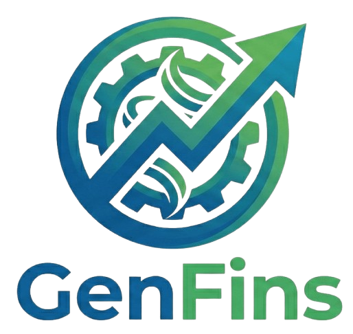

<div align="center">
  

  <h1>GenFinds v2</h1>

  <p>Aplicativo de finanças pessoais multiplataforma — Desktop (Windows) e Mobile (Android)</p>

  <p>
    
    
    
    
    
  </p>
</div>

---

## Sobre o projeto

O **GenFinds** é um aplicativo de finanças pessoais com foco em privacidade: os dados ficam 100% no dispositivo do usuário, sem servidores externos. A versão 2 foi reescrita do zero com uma nova stack moderna que permite compartilhar ~90% do código entre o app desktop (Windows) e o app mobile (Android).

**Funcionalidades principais:**

- Dashboard com resumo financeiro, gráfico de evolução e lembretes
- Lançamento de receitas e despesas com categorias e contas
- Gerenciamento completo de cartões de crédito com parcelamento automático
- Relatórios com gráficos interativos (pizza por categoria, barras receita vs despesa)
- Importação de extrato bancário via arquivo OFX
- Múltiplos usuários com senhas hasheadas (bcrypt / argon2)
- Backup e exportação do banco de dados local
- Modo escuro / claro com persistência

---

## Stack tecnológica

| Camada | Tecnologia |
|--------|-----------|
| Framework UI | React 19 + TypeScript 5 |
| Build & Dev | Vite 6 + electron-vite |
| Desktop shell | Electron 36 + electron-builder |
| Mobile shell | Capacitor 7 + Android |
| Estilo | Tailwind CSS 4 + shadcn/ui |
| Componentes | Lucide React + Recharts |
| Estado global | Zustand |
| Dados assíncronos | TanStack Query v5 |
| Banco (desktop) | sql.js (SQLite em memória → arquivo) |
| Banco (mobile) | @capacitor-community/sqlite |
| Validação | Zod |
| Precisão monetária | Decimal.js |
| Hash de senha (desktop) | bcrypt |
| Hash de senha (mobile) | @noble/argon2 (WASM) |
| Testes unitários | Vitest |
| Testes E2E desktop | Playwright |
| Testes E2E mobile | Maestro |
| Logs (desktop) | Winston |

---

## Pré-requisitos

- [Node.js](https://nodejs.org/) 22+
- [Git](https://git-scm.com/)
- **Para mobile:** Android Studio + Android SDK 34+

---

## Instalação e desenvolvimento

```bash
# Clonar o repositório
git clone https://github.com/KassianoV/GenFinds.git
cd GenFinds
git checkout develop-v2

# Instalar dependências
npm install

# Iniciar em modo desenvolvimento (desktop)
npm run dev

# Sincronizar com o projeto Android e abrir no Android Studio
npm run build
npx cap sync android
npx cap open android
```

---

## Comandos disponíveis

```bash
# Desenvolvimento
npm run dev              # Electron com hot reload
npm run build            # Compila TypeScript + Vite

# Qualidade de código
npm run lint             # ESLint 9 (flat config)
npm run lint:fix         # Corrige automaticamente
npm run format           # Prettier
npm run typecheck        # tsc --noEmit

# Testes
npm test                 # Vitest (unitários)
npm run test:coverage    # Cobertura (mínimo 80%)
npm run test:e2e         # Playwright (desktop)

# Build de produção
npm run build:desktop    # Instalador Windows (.exe + portable)
npm run build:android    # APK Android via Gradle
```

---

## Estrutura do projeto

```
GenFinds/
├── electron/                # Processo main do Electron
│   ├── main.ts              # Ponto de entrada, handlers IPC
│   ├── preload.ts           # Bridge contextBridge → renderer
│   ├── database.ts          # DatabaseManager (sql.js)
│   ├── validation.ts        # Schemas Zod para todos os handlers
│   └── logger.ts            # Winston logger
├── src/                     # Código React compartilhado
│   ├── components/
│   │   ├── shared/          # Componentes reutilizáveis (ErrorBoundary, Skeleton…)
│   │   ├── layout/          # AppShell, Sidebar, BottomTabBar
│   │   └── ui/              # shadcn/ui (gerado)
│   ├── pages/               # Dashboard, Transacoes, Cartoes, Relatorios, Config
│   ├── hooks/               # TanStack Query hooks por domínio
│   ├── store/               # Zustand stores (authStore, appStore)
│   ├── services/
│   │   ├── platform.ts      # isElectron() / isCapacitor()
│   │   ├── database/
│   │   │   ├── types.ts     # Interface DatabaseService
│   │   │   ├── desktop.ts   # Implementação via window.api (IPC)
│   │   │   └── mobile.ts    # Implementação via @capacitor-community/sqlite
│   │   └── auth/
│   │       └── hashPassword.ts  # bcrypt (desktop) / argon2 (mobile)
│   ├── lib/
│   │   ├── queryClient.ts   # Configuração TanStack Query
│   │   └── format.ts        # Formatação monetária e de datas
│   ├── types/
│   │   └── database.types.ts
│   └── constants.ts         # Cores de categorias, ícones, config geral
├── test/
│   ├── unit/                # Vitest — services e lógica de negócio
│   ├── e2e/                 # Playwright — fluxos desktop
│   └── mobile/              # Maestro flows — fluxos Android
├── android/                 # Projeto Android (gerado pelo Capacitor — não editar)
├── Dev/                     # Documentação de desenvolvimento
│   └── Kanban - GenFinds v2.md
├── assets/                  # Ícones e splash screen
├── capacitor.config.ts
├── electron-builder.config.ts
├── vite.config.ts
├── vitest.config.ts
├── playwright.config.ts
├── tsconfig.json
├── tsconfig.node.json
├── tsconfig.web.json
└── .github/
    └── workflows/
        └── ci.yml
```

---

## Arquitetura multiplataforma

```
┌─────────────────────────────────────────────┐
│           React + TypeScript (src/)          │
│  Componentes • Hooks • Stores • Pages        │
└────────────────┬───────────────┬────────────┘
                 │               │
    ┌────────────▼───┐   ┌───────▼──────────┐
    │  Electron (IPC) │   │  Capacitor (API)  │
    │  Desktop Win    │   │  Android          │
    │  sql.js + bcrypt│   │  sqlite + argon2  │
    └─────────────────┘   └──────────────────┘
```

O módulo `src/services/platform.ts` detecta o ambiente em tempo de execução e seleciona a implementação correta — sem `if/else` espalhados pelo código de UI.

---

## Segurança

- Senhas hasheadas com bcrypt (saltRounds=12) no desktop e argon2 WASM no mobile
- Validação Zod obrigatória em todos os handlers IPC antes de qualquer acesso ao banco
- Queries 100% parametrizadas — sem concatenação de strings SQL
- CSP configurado para bloquear scripts externos e inline
- Rate limiting no login: 5 tentativas → bloqueio de 15 minutos
- `PRAGMA foreign_keys = ON` ativo em todas as conexões

---

## Contribuindo

Este é um projeto pessoal em desenvolvimento ativo. A branch principal de desenvolvimento é `develop-v2`; `master` contém apenas código estável/lançado.

```bash
git checkout develop-v2
git checkout -b feat/nome-da-feature
# ... faça suas alterações ...
git commit -m "feat(Modulo): descrição"
git push origin feat/nome-da-feature
```

Consulte o [Kanban de desenvolvimento](Dev/Kanban%20-%20GenFinds%20v2.md) para ver o que está sendo trabalhado.

---

## Licença

Este software é de uso pessoal e privado. Consulte o arquivo `LICENSE` para detalhes.

---

<div align="center">
  <sub>Desenvolvido por <a href="https://github.com/KassianoV">Kassiano Vieira</a></sub>
</div>
